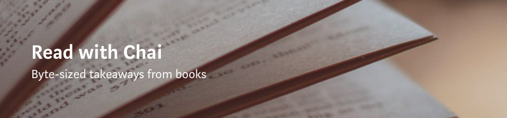

# Books

This list is a Work in Progress. It has been maintained by Chaitanya Bapat based on recommendations from real-life people, articles, mailing lists, among other things.  Originally, this repo was conceptualized as a Git-based summarization for books. However, realizing that it quickly blows up out of proportion, this remains a list of completed, ongoing and upcoming books on his radar. Moreover, the summaries of the books have been transferred over to a Medium publication by the name **[Read with Chai](https://medium.com/read-with-chai)**.

## Medium Publication
### [Read with Chai](https://medium.com/read-with-chai)

This Medium publication houses over 20+ articles on summaries & **byte-sized take-aways** from the books read so far.

## Contributions

Feel free to drop your suggestions via Issues/Pull Requests. Additoinally, if you have summaries of your own, do share.

## Ongoing
1. A Random Walk Down Wall Street by Burton G. Malkiel
3. 

## Discontinued
1. Bursts

## Miscellaneous
1. The Black Swan: The Impact of the Highly Improbable - Nassim Nicholas Taleb
1. The Hard Thing About Hard Things - Book by Ben Horowitz
2. Beyond Freedom and Dignity by B.F. Skinner
2. How to talk to anyone (92 lil tricks for big success in relationships) Leil Lowndes
5. "Quiet: The Power of Introverts in a World That Can’t Stop Talking" by Susan Cain. 
6. how to stop worrying and start living dale carnegie
7. how to win friends and influence people dale carnegie
8. The Power of Your Subconscious Mind Paperback – Dr. Joseph murphy
9. When Breath Becomes Air - Paul Kalanithi
11. Emotional Agility - Susan David
12. Chasing the Scream - Johann Hari
13. What i know for sure - oprah winfrey
15. The Small Big - small changes that spark big influence
16. Musicophilia - Oliver Sacks
17. How to lie with statistics?
18. magic of thinking big
19. Paul Graham, How You Know
20. Seth Godin the dip
21. Proust and the Squid: The Story and Science of the Reading Brain: - maryanne wolf
22. The Power of One Percent Better: Small Gains, Maximum Results
23. This is water by dfw
24. If by Rudyard kipling
25. Pale blue dot by Carl sagan
26. Self reliance by emerson
27. Existentialism: From Dostoyevsky to Sartre. 
28. Being and Nothingness by Jean-Paul
1. Seeking Wisdom by Peter Bevelin—Discusses the mental models of Charlie Munger and Warren Buffett.
1. Fooled By Randomness by Nassim Taleb—One of my favorite mental models. Helps with understanding how random events influence outcomes.
1. Nudge by Richard Thaler and Cass Sunstein—Explains how our decisions are influenced by different factors.
1. ~~**China in the 21st century - what everyone needs to know**~~

### Historical
1. ~~**Pablo Escobar - my father - Juan pablo escobar**~~
1. Inglorious Empire by Shashi Tharoor
2. Black Flags: The Rise of ISIS by Joby Warric
3. Gideon's Spies - Gordon Thomas
4. The Best We Could Do, by Thi Bui. (Vietnam War family)
5. The Sympathizer, by Viet Thanh Nguyen
6. Energy and Civilization: A History, by Vaclav Smil
7. Study of Civilization - Will and Ariel Durant
8. ~~**Yuval Noah Harari — Sapiens**~~

### Technical
1. Gentle Introduction to Apache Spark
2. Grokking Deep Learning - Andrew Trask
3. Developing Analytic Talent: Becoming a Data Scientist / Edition 1 by Vincent Granville
4. Deep Learning with python francois cholle
1. Truth machine blockchain future everything

### Finance / Investment / Economics (MONEY $$$)
1. **Intelligent investor by benjamin graham** [WIP]
1. ~~**[Cashflow quadrant - Robert Kiyosaki](https://medium.com/read-with-chai/cashflow-quadrant-f1d42a2b462a)**~~
1. ~~**[Millionaire Success Habits - Dead Graziosi](https://medium.com/read-with-chai/millionaire-success-habits-d1526db31495)**~~
1. The Richest Man In Babylon by George S. Clason
1. Your money or your life - vicky robin
1. The Little Book of Common Sense Investing by Jack Bogle
1. A Random Walk Down Wall Street by Burton G. Malkiel
1. How buffet does it?
2. Evicted: Poverty and Profit in the American City, by Matthew Desmond
3. Barter to Bitcoin - Ravin aarya
4. The Coffeehouse Investor: How to Build Wealth, Ignore Wall Street, and Get On with Your Life
7. THE ONLY INVESTMENT GUIDE YOU’LL EVER NEED
9. THE INTELLIGENT INVESTOR: THE DEFINITIVE BOOK ON VALUE INVESTING. A BOOK OF PRACTICAL COUNSEL (REVISED EDITION) (COLLINS BUSINESS ESSENTIALS)
10. THE MILLIONAIRE REAL ESTATE INVESTOR
12 millionaire fast lane mj demarc
13 made inamerica sam walton
14. More money than god - sebastian mallaby
15. the billionaire's apprentice - anita raghavan
16. differentiate or die - survival in our era of killer competition
1. The Snowball: Warren Buffett and the Business of Life - Alice Schroeder
1. 1000 ways to make 1000$ [Buffet's favorite book]
1. cashing in on american dream - retire at 35 - By Paul Terhorst
1. millionaire next door - By Thomas J. Stanley and William D. Danko
1. “The Wealthy Barber” By David Chilton
1. “The Automatic Millionaire” By David Bach
1. “The Bogleheads’ Guide to Investing” By Taylor Larimore, Mel Landauer and Michael LeBoeuf
1. "If You Can: How Millennials Can Get Rich Slowly" By William Bernstein
1. Market Wizards by Jack D. Schwager
1. Wall Street The Other Las Vegas by Nicolas Darvas
1. How I made $2,000,000 on the Stock Market by Nicolas Darvas
1. How to trade in stocks by Jesse Livermore
1. How to make money in stocks by O'Neil
1. New Market Wizards - Conversations with America's Top Wizards by Schwager
1. Come into my trading room by Elder
1. Trade your way to 
1. Complete Turtle Trader by Michael W. Covel
1. Trend Following by Covel
1. The Simple Path to Wealth by JL Collins
1. ~~**[Fearless Salary Negotiation](https://medium.com/read-with-chai/fearless-salary-negotiation-250330afa269)**~~

### Fiction
1. John Green’s new novel, Turtles All the Way Down,

### Legal
1. The Color of Law by Richard Rothstein
2. 

### AutoBio
1. Believe Me: A Memoir of Love, Death, and Jazz Chickens, by Eddie Izzard
2. my spiritual journey dalai lama
3. 

## Bio
1. Mark Zuckerberg: Ten Lessons In Leadership by Michael Essan
2. Inside Apple Adam Lashinsky
1. ~~**[Hit refresh - Satya Nadella](https://medium.com/read-with-chai/hit-refresh-1dc785d1a199)**~~

### Motivational / Self-Help / Productivity
1. ~~**[5AM Book Club by Robin Sharma](https://medium.com/read-with-chai/5am-club-b107f0f800e3)**~~
1. Four hour workweek by Tim Ferris
1. ~~**[Show your work - Kleon Austin](https://medium.com/read-with-chai/show-your-work-cf35ef02cfda)**~~
1. Anything you want - Derek Sivers
1. Thinking fast and slow by Daniel Kahneman
2. 7 habits of highly influential people
3. Memorization - How to Develop a Brilliant Memory Week by Week
4. ~~**Checklist Manifesto by Atul Gawande**~~
5. clear your clutter with feng shui
1. ~~**[The life changing magic of tidying up - Marie Kondo](https://medium.com/read-with-chai/the-life-changing-magic-of-tidying-up-93822eb7d528)**~~
1. paradox of choice 
1. ~~**The subtle art of not giving a fuck - Mark Mason**~~
1. ~~**Do it today - Darius Foroux**~~
1. ~~**Deep Work - Cal Newport**~~
1. Seeking Wisdom by Peter Bevelin
1. Mark McCormack what they don't teach you at HBS
1. Dr. Will Miller and Glenn Sparks, in their book Refrigerator Rights: Creating Connections and Restoring Relationships
1. ~~**Never Eat Alone - Keith Ferrazzi**~~
1. The Six thinking hats - Edward Bono
1. “Getting Things Done: The Art of Stress-Free Productivity”, David Alle
1. ~~**Originals: How Non-Conformists Move the World: Adam Grant, Sheryl Sandberg**~~
1. Outliers
1. 21 lessons for the 21st century by yuval noah harari

### Business / Leadership
1. ~~Super Pumped: The Battle for Uber - Mike Isaac~~
1. ~~**[Zero To One by Peter Thiel](https://medium.com/read-with-chai/zero-to-one-b5d93f399cf8)**~~
1. Option B - Sheryl Sandberg
2. power of moments
4. barking up wrong tree
5. the four
6. reset ellen pao
7. tehnically wrong
8. the four tendencies - gretchen rubin
9. perennial seller - ryan holiday
10. wierd is a world that's not
11. The psycholigy of selling brian tracy
1. Starting a Business All-in-One For Dummies
1. Million Dollar Consulting: The Professional’s Guide to Growing a Practice
12. ~~**Rich dad poor dad - Robery Kiyosaki**~~ [need to reread]
13. ~~**Eyes wide open - Isaac Lidsky**~~
1. ~~**MBA To do or not to**~~
1. ~~**[The Tipping Point - Malcolm Gladwell](https://medium.com/read-with-chai/the-tipping-point-f9f63eda02ef)**~~

## Science
1. visual intelligence amy eherman

## Sports
1. ~~**Playing it my way - Sachin Tendulkar**~~
1. ~~**The test of my life - Yuvraj Singh**~~
1. and god created cricket - simon hughes
1. i dont like cricket i love it - chris gayle
1. roy going for broke - andrew symonds
1. Out of my comfort zone - steve waugh
1. corner of a foreign field - ramachandra guha
1. clear blue sky jonny bairstow
1. beyond a boundary clr james
1. ab devilliers - autobio
1. Driven: The Virat Kohli Story by Vijay Lokapally
1. century is not enough - sourav ganguly
1. dhoni touch - unraveling enigma
1. second innings - andrew flintoff
1. think and win like dhoni 
1. glenn maxwell lucky break
1. its not about bike - lance armstrong

## Epics
1. Mahabharata [WIP]
2. Ramayana
